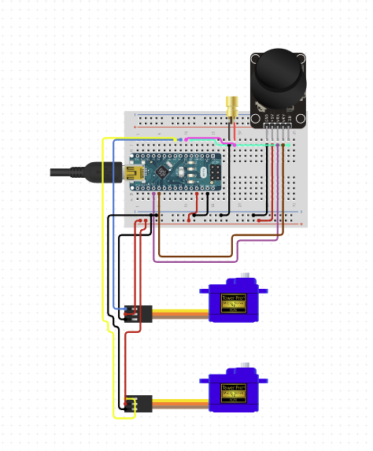

For those who have pets, specifically cats, know just how much they love lasers. Something about that little red dot makes them go crazy and chase it, and thus for this project, I set out to make a toy that could make entertaining one’s cats an easier task for those on-the-go pet owners. 

The device I have designed is composed of several components. First, I chose to use an Arduino Nano rather than the Adafruit playground because the adafruit does not really allow for connection using Dupont wires which are standard for hobby electronics, as the adafruit only has alligator clip pads which serve their purpose to prevent soldering, but actually make it more difficult to use common components. Additionally, the Arduino is a much cheaper board than the Adafruit playground, costing only $5 per board, whereas the Adafruit playground costs about $26. The device also is composed of two servos along with some 3D-printed parts to make up the pan-tilt mechanism, which will point the laser in any direction within a bound set of angles. This pan-tilt gantry is then controlled by a joystick, allowing for the user to control where the included 5mW laser points manually. Now what truly sets the design apart is the automated mode, which can be toggled between by pressing in the joystick. the two modes of control, controlled mode and automated mode. The automated mode works by picking a random point within the effective operating range and moving to it. It will repeat this process and move to a new random spot every second. This time delay was tested on my own cat and proved to be a good balance between quick movements, which cats love, and enough time for the cat to actually get to where the red dot is before changing positions.   

This project was created using the PlatformIO[] extension in VS Code. Thus, as can be seen below, the project is structured as all projects of this manner are:  

<pre>
.
├── README.md
├── Screen\ Shot\ 2021-11-21\ at\ 11.23.24\ PM.png
├── include
│   └── README
├── lib
│   └── README
├── platformio.ini
├── src
│   └── main.cpp
└── test
    └── README
</pre>

Where the operational code is contained within src/main.cpp. 

Also, the curcuit diagram for the project can be seen below:

